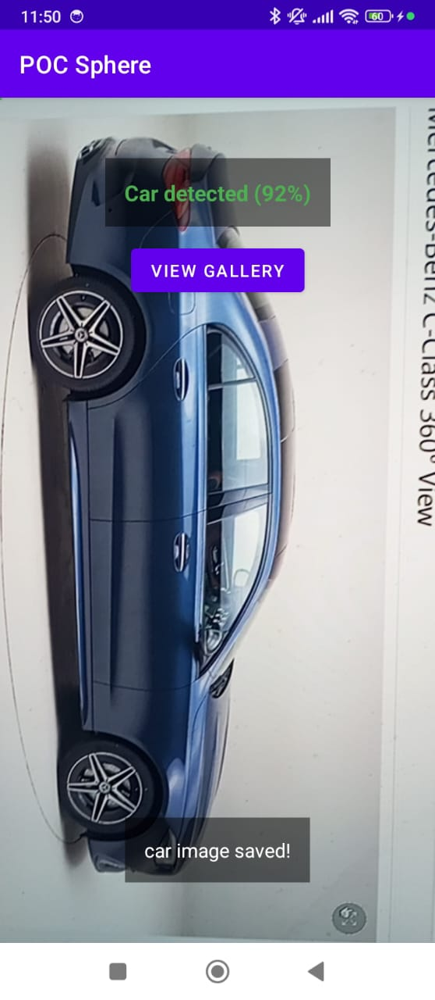
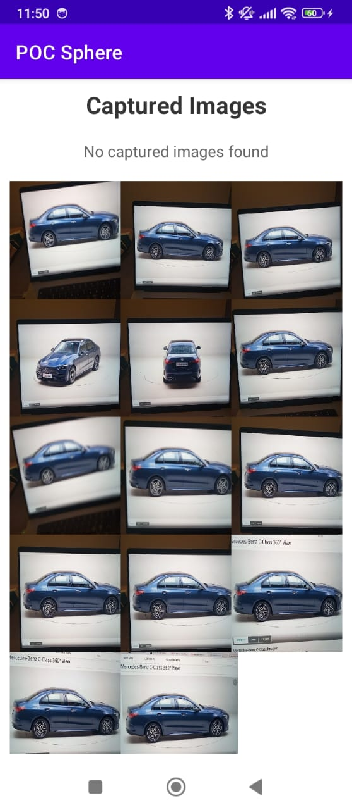

# ML YOLO8 Android Kotlin

A real-time object detection Android application built with Kotlin, TensorFlow Lite, and YOLOv8. This app can detect 80 different object classes in real-time using your device's camera or from images in your gallery.

## 🚀 Features

- **Real-time Object Detection**: Detect objects in real-time using the device camera
- **Gallery Support**: Analyze images from your device gallery
- **80 Object Classes**: Supports detection of 80 different object types (COCO dataset)
- **GPU Acceleration**: Optimized with TensorFlow Lite GPU delegate for better performance
- **Modern UI**: Clean and intuitive user interface with detection overlays
- **Permission Handling**: Proper camera and storage permission management
- **Image Capture**: Capture and save detected images


## 📱 Demo

<div style="display: flex; overflow-x: auto; gap: 20px; padding: 10px 0;">
  
  
</div>

### 📲 Download Demo APK

[](https://drive.google.com/file/d/1SpbFORqq2wv1ieKcqPXlrihURvV3mSNo/view?usp=share_link)

*Download and install the demo APK to try the app on your Android device. Make sure to enable "Install from Unknown Sources" in your device settings.*

## 🚀 Technical Stack

- **Language**: Kotlin
- **ML Framework**: TensorFlow Lite
- **Model**: YOLOv8 (TensorFlow Lite format)
- **Camera**: CameraX API
- **Architecture**: MVVM with ViewModel and LiveData
- **Minimum SDK**: API 24 (Android 7.0)
- **Target SDK**: API 36 (Android 14)

## 📋 Prerequisites

- Android Studio Arctic Fox or later
- Android SDK API 24+
- Kotlin 1.8+
- Gradle 8.0+

## 🚀 Getting Started

### 1. Clone the Repository

```bash
git clone https://github.com/yourusername/ml-yolo8-android-kotlin.git
cd ml-yolo8-android-kotlin
```

### 2. Open in Android Studio

1. Open Android Studio
2. Select "Open an existing Android Studio project"
3. Navigate to the cloned directory and select it

### 3. Build and Run

1. Connect an Android device or start an emulator
2. Click the "Run" button (green play icon) in Android Studio
3. Select your target device and click "OK"

### 4. Grant Permissions

On first launch, the app will request:
- Camera permission (for real-time detection)
- Storage permission (for gallery access)

## 📁 Project Structure

```
app/
├── src/main/
│   ├── java/com/pushpendra/pocsphere/
│   │   ├── MainActivity.kt              # Main camera activity
│   │   ├── GalleryActivity.kt           # Gallery image selection
│   │   ├── ImagePreviewActivity.kt      # Image preview with detections
│   │   ├── YOLOv8Detector.kt            # Core detection logic
│   │   ├── MainViewModel.kt             # ViewModel for data management
│   │   ├── OverlayView.kt               # Detection box overlay
│   │   ├── PermissionHandler.kt         # Permission management
│   │   └── ImageCaptureUtil.kt          # Image capture utilities
│   ├── assets/
│   │   ├── model.tflite                 # YOLOv8 TensorFlow Lite model
│   │   └── labels.txt                   # COCO dataset labels
│   └── res/
│       └── layout/
│           ├── activity_main.xml        # Main camera layout
│           ├── activity_gallery.xml     # Gallery layout
│           └── activity_image_preview.xml # Preview layout
```

## 🔧 Configuration

### Model Configuration

The app uses a pre-trained YOLOv8 model converted to TensorFlow Lite format. Key configuration parameters in `YOLOv8Detector.kt`:

```kotlin
private const val CONFIDENCE_THRESHOLD = 0.3F  // Detection confidence threshold
private const val IOU_THRESHOLD = 0.5F         // Non-maximum suppression threshold
```

### Performance Optimization

- **GPU Acceleration**: Enabled by default for better inference speed
- **Multi-threading**: Uses 4 threads for TensorFlow Lite inference
- **Memory Management**: Proper cleanup of resources and image buffers

## 📊 Supported Object Classes

The app can detect 80 different object classes including:
- People, animals (person, cat, dog, horse, etc.)
- Vehicles (car, bicycle, motorcycle, bus, truck, etc.)
- Common objects (chair, table, laptop, phone, etc.)
- Food items (pizza, apple, banana, etc.)
- And many more...

See `app/src/main/assets/labels.txt` for the complete list.

## 🔍 Usage

### Real-time Detection
1. Launch the app
2. Grant camera permission when prompted
3. Point the camera at objects
4. Detection results will appear on screen with bounding boxes

### Gallery Detection
1. Tap the "Gallery" button
2. Select an image from your device
3. View detection results with bounding boxes
4. Tap on detections for detailed information

## 🧪 Testing

### Unit Tests
```bash
./gradlew test
```

### Instrumented Tests
```bash
./gradlew connectedAndroidTest
```

## 📈 Performance

- **Inference Time**: ~50-100ms per frame (depending on device)
- **Memory Usage**: ~150-200MB
- **Model Size**: ~6MB (compressed)

## 🤝 Contributing

1. Fork the repository
2. Create a feature branch (`git checkout -b feature/amazing-feature`)
3. Commit your changes (`git commit -m 'Add some amazing feature'`)
4. Push to the branch (`git push origin feature/amazing-feature`)
5. Open a Pull Request

## 📝 License

This project is licensed under the MIT License - see the [LICENSE](LICENSE) file for details.

## 🙏 Acknowledgments

- [Ultralytics YOLOv8](https://github.com/ultralytics/ultralytics) - The original YOLOv8 implementation
- [TensorFlow Lite](https://www.tensorflow.org/lite) - Mobile ML framework
- [CameraX](https://developer.android.com/training/camerax) - Modern camera API
- [COCO Dataset](https://cocodataset.org/) - Object detection dataset

## 📞 Support

If you encounter any issues or have questions:

1. Check the [Issues](https://github.com/pushpendra996/ml-yolo8-android-kotlin/issues) page
2. Create a new issue with detailed information
3. Include device information and steps to reproduce

## 🔄 Updates

- **v1.0**: Initial release with real-time detection and gallery support
- Future updates will include model optimization and additional features

---

**Note**: This app requires a device with sufficient computational power for real-time inference. Performance may vary based on device specifications.